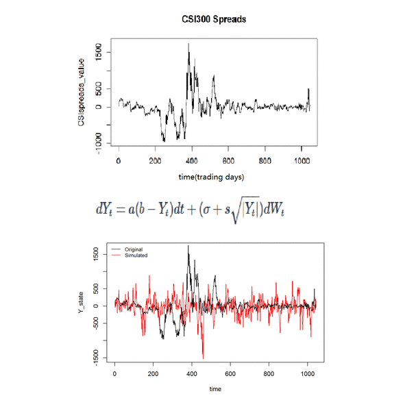

### Welcome to Yuankang Xiong GitHub Pages

Yuankang Xiong is a second year student in the Quantitative Finance and Risk Management Master's program. He earned a Bachelor's Degree in Thermal and Power Engineering and a Bachelor's Degree in Finance from Huazhong University of Science and Technology. He also holds a Master's Degree in Financial Economics from Singapore Management University.  

Yuankang has programming experiences in C/C++, MATLAB ,Python, R and is a Level II CFA Candidate. He is interested in statistics, econometrics, forecasting and risk management.

- His profile website can be found [here](https://lsa.umich.edu/math/people/quant/2017/ricxiong.html).This page was updated at the beginning of 2019.

- For Yuankang's quantitative finance thesis, project reports, source codes, please click the Quantitative Finance Files Repository on the left.  

### Quantitative Finance Files Repository

- For all files, plick click [here](https://github.com/RickYuankangHung/Quantitative-Finance)


- _CIR model estimation for spot-futures spread in China and the US market_. HTML file can be downloaded [here](https://github.com/RickYuankangHung/Quantitative-Finance/blob/master/531FinalProjectVersion2.1.html).

- In this project, we use a variation of CIR model which is a Markov process and the IF2 algorithm to find an appropriate model for spot-futures spread. The POMP simulations are beneficial for exploration of the proper form of the model and the FLUX is conducive to the estimation of parameters. 

- For CSI300 spreads data, given initial values and starting values, the sigma, s and a converges well. Sigma should be around 35.3932. S should be around 6.305309 while a is 0.09316657. Parameter b does not converge well which is acceptable because the stationary mean model does not seem to fit the data although we know that in the long run the spread process should have mean 0.




```markdown


# Quantitative Finance Files
## Machine Learning Files
### Resumes

- Bulleted
- List

1. Numbered
2. List

**Bold** and _Italic_ and `Code` text

[Link](https://github.com/RickYuankangHung/Quantitative-Finance) and 
```

For more details see [GitHub Flavored Markdown](https://guides.github.com/features/mastering-markdown/).

### Machine Learning Files Repository
