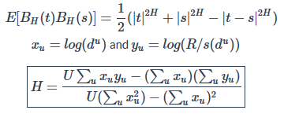
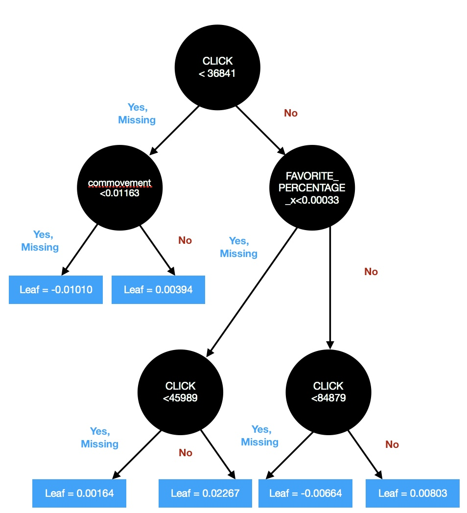
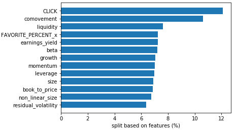
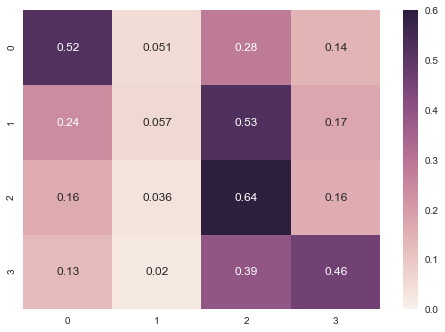
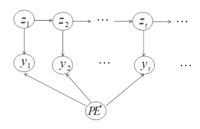
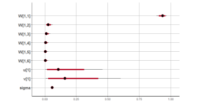
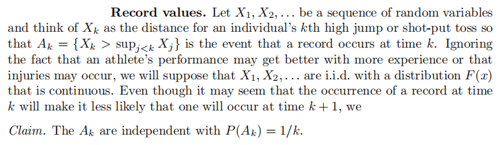

### Welcome to Yuankang Xiong GitHub Pages ^_^

Yuankang Xiong is a graduate from the Quantitative Finance and Risk Management Master's program. He earned a Bachelor's Degree in Thermal and Power Engineering and a Bachelor's Degree in Finance from Huazhong University of Science and Technology. He also holds a Master's Degree in Financial Economics from Singapore Management University.  

He as the team captain won the Eighth International Association of Quantitative Finance (IAQF) Annual Academic Affiliate Membership Student Competition. The link can be found [here](https://www.iaqf.org/news/news_detail/58).

Yuankang has programming experiences in C/C++, MATLAB ,Python, R and is a Level III CFA Candidate. He is interested in statistics, econometrics, forecasting and risk management.

- His profile website can be found [here](https://lsa.umich.edu/math/people/quant/2017/ricxiong.html). This page was updated in the middle of 2019.

- For Yuankang's quantitative finance thesis, project reports, source codes, please click the link below.  

### Quantitative Finance Files Repository

1. For browsing all files, please click [here](https://github.com/RickYuankangHung/Quantitative-Finance)

### Statistical Inference of Financial Time Series Examples

1. _CIR model estimation for spot-futures spread in China and the US market_. HTML file can be downloaded [here](https://github.com/RickYuankangHung/Quantitative-Finance/blob/master/531FinalProjectVersion2.1.html). Please download the HTML and browse.

- In this project, we use a variation of CIR model which is a Markov process and the IF2 algorithm to find an appropriate model for spot-futures spread. The POMP simulations are beneficial for exploration of the proper form of the model and the FLUX is conducive to the estimation of parameters.

- For CSI300 spreads data, given initial values and starting values, the sigma, s and a converges well. Sigma should be around 35.3932. S should be around 6.305309 while a is 0.09316657. Parameter b does not converge well which is acceptable because the stationary mean model does not seem to fit the data although we know that in the long run the spread process should have mean 0.

2. _Do Returns Have Trends, Long Memory, Autocorrelation and Cycles? : Evidence from Markets of Different Financial Products and Regions_. HTML file can be downloaded [here](https://github.com/RickYuankangHung/Quantitative-Finance/blob/master/FractionalBrownianMotion.html). Please download the HTML and browse.

- In this study, we explore several kinds of financial times series by adopting various time series techniques covered in class such as SARIMA, parameter estimation, spectral analysis, and extra techniques such as estimating Hurst parameter to give some statistical, mathematical and financial explanations for empirical phenomena.

- According to Hurst estimates, S&P500 index daily log returns are observed to have severe positive autocorrelation during financial crises. During other time period after Jan 3rd, 2000, the random walk model seems to fit the accumulated log returns quite well, which means the daily log returns are not linearly correlated.

The formulas are given above and the estimate time series on the US and China market are provided below.

### Machine Learning Application in Finance Examples

1. _Effect of Investor Attention on Stock Return_. PDF file can be downloaded [here](https://github.com/RickYuankangShong-Quantitative-Finance/Quantitative-Finance/blob/master/545Project.pdf). You may browse the PDF in GitHub directly.

- In this report, we analyzed the relationship between investor attention and stock return in China A-share market. We firstly divided stock returns into four classes by their quantile and changed our problem into a classfication problem. And then, we used extreme gradient boosting tree (XGBoost) model to predict stock returns. By adding investor attention factors, we improved roughly 7% model performance in stock return prediction compared with using only classic financial factors. It shows that investor attention factors act as a useful feature on explaining stock returns.

### Markov Chain Monte Carlo Parameter Estimating Examples

1. _Stock Trading Strategy based on Dynamic Bayesian Network_. PDF file can be downloaded [here](https://github.com/RickYuankangShong-Quantitative-Finance/Quantitative-Finance/blob/master/Bayesian_Modeling.pdf). You may browse the PDF in GitHub directly.

- The pricing earnings (PE) ratio is a widely used index for constructing investment strategy in a security market. There exist hiddenpatterns in PE ratio. In this project, we implement an advanced dynamic Bayesian network (DBN) methodology for value investmentthrough fundamental PE estimations. Two algorithms are adopted to estimate the parameters in RStan. Diagnostics and posterior predictivedistribution show the validity of the model. The estimated PE ratio from our model can be used either as a information support for an expertto make investment decisions, or as an automatic trading system illustrated in experiments. Different from existing works in literature, theeconomic interpretation of our DBN model is well-justified by behavioral finance evidences of volatility.

### Interesting Probability Examples

